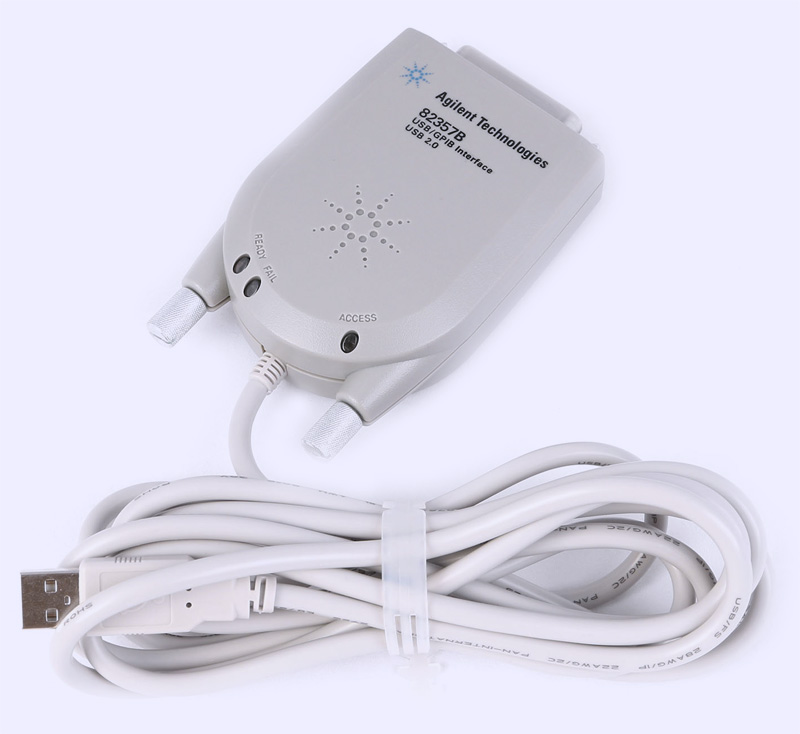

# gpib
General Purpose Interface Bus or IEEE 488 bus 

# Project overview
Use Linux OS to get the Agilent/Keysight 82357B GPIB bus up-and-running. Software is written in Perl.

# Requirements
  * Linux packages

The project needs some Linux packages. Use script [installLinux.sh](scripts/installLinux.sh) for installing those packages in Mint or Ubuntu.

* The kernel version

Determine the currenct kernel version

`uname -r`

* Get the linux header files

`sudo apt-get install linux-headers-$(uname -r)`

NOTE: Some rpi release cannot download the header files with the command. Check in /lib/modules if the header files already exist.

Kernel source for 4.19.58-v7+: https://github.com/raspberrypi/linux

* Kernel updates

Linux has regular kernel-updates and then the gpib-sources should be compiled against the new kernel. 
I did not like that, so I have setup the grub to boot with a specific kernel version.

You can edit your grub config file or use a nice tool like [grub-customizer](https://www.fosslinux.com/4300/how-to-edit-grub-bootloader-and-remove-unwanted-entries-in-ubuntu.htm).

* Download the correct Linux GPIB software from [Linux GPIB Package Homepage](https://linux-gpib.sourceforge.io/) 

Current Linux mint versions have kernel version 4.x.x. and then Linux-GPIB version 3.2.x or later is required.
Download from [here](https://sourceforge.net/projects/linux-gpib/files/)

At this time, linux-gpib-4.3.0.tar.gz, is the latest version for kernel 4.x.x. versions.

Extract the tar in /opt

`sudo tar xvf linux-gpib-4.3.0.tar.gz -C /opt`

In directory /opt/linux-gpib-4.3.0 there are two tar files:

  * linux-gpib-kernel-4.3.0.tar.gz
  * linux-gpib-user-4.3.0.tar.gz

Extract both files.

* Compile the gpib-kernel 
>
    cd /opt/linux-gpib-4.3.0/linux-gpib-kernel-4.3.0  
    make
    make install
    
* Compile the user code
>
    cd /opt/linux-gpib-4.3.0/linux-gpib-user-4.3.0
    make
    make install

* Load the modules in the kernel
> 
    $ sudo modprobe gpib_common
    $ sudo modprobe agilent_82357a

* Firmware upgrade for the gpib firmware

Download the software from [sourceforge.io](https://linux-gpib.sourceforge.io/firmware/)

Extract the file in /opt
>
sudo tar xvf gpib_firmware-2008-08-10.tar.gz -C /opt

The firmware for Agilent 82357B is *measat_releaseX1.8.hex* in folder /opt/gpib_firmware-2008-08-10/agilent_82357a.

# Connecting the Agilent 82357B GPIB

* Check is the usb device is regonized by the OS
>
    # lsusb
    Bus 002 Device 006: ID 0957:0518 Agilent Technologies, Inc. 82357B GPIB Interface

* Check the current firmware version of the connected USB device
>
    GPIB_DEV=`lsusb | grep Agilent`
    FIRMWARE=`echo $GPIB_DEV | awk '{ print $6 }'`

 

* Determine the USB device
>
    DEV1=`echo $GPIB_DEV | awk '{ print $2 }'`
    DEV2=`echo $GPIB_DEV | awk '{ print $4 }' | sed 's/://'`
    DEV="/dev/bus/usb/$DEV1/$DEV2"

* Load the firmware into the Agilent 82357B

	export FIRMWARE_FILE=/opt/gpib_firmware-2008-08-10/agilent_82357a/82357a_fw.hex
    fxload -t fx2 -D $DEV -I $FIRMWARE_FILE
    
If final firmware must be **0957:0718**. If not, use fxload again. In two steps the firmware should be loaded and the lights should be green.

